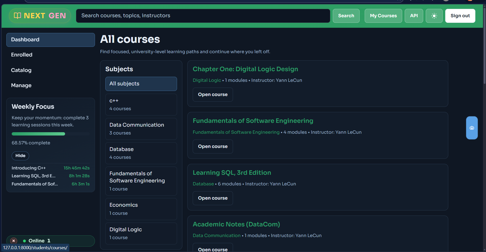
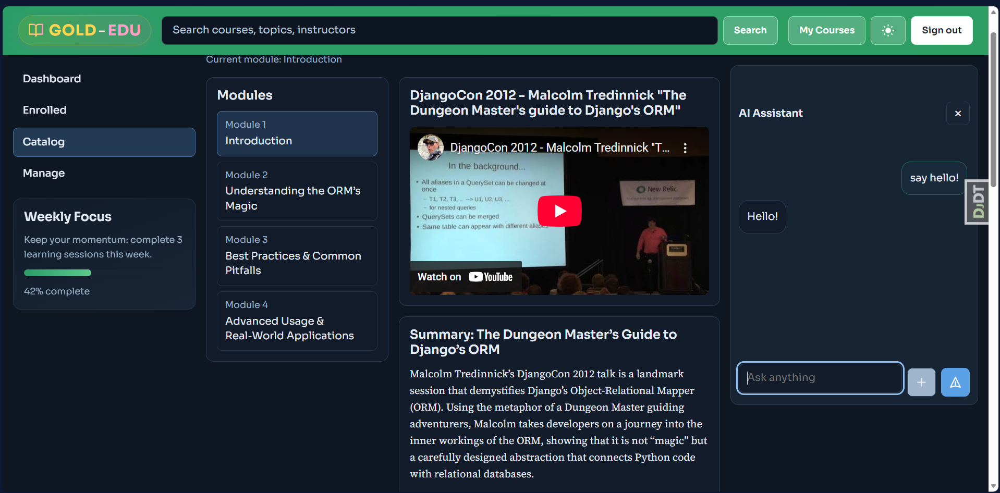

# Gold-EDU E-Learning Platform

A production-oriented Django learning management system for course publishing, enrollment, module-based learning, and in-page AI assistance.

## Preview

<!-- Replace these placeholders with your final screenshots -->





## Table of Contents

- [Overview](#overview)
- [Core Features](#core-features)
- [Tech Stack](#tech-stack)
- [Project Structure](#project-structure)
- [Getting Started](#getting-started)
- [Environment Variables](#environment-variables)
- [Key Routes](#key-routes)
- [AI Assistant Notes](#ai-assistant-notes)
- [Dark Mode](#dark-mode)
- [Roadmap](#roadmap)
- [Contributing](#contributing)
- [License](#license)

## Overview

Gold-EDU is a university-focused e-learning platform built with Django. It supports:

- Public course discovery by subject
- Student enrollment and learning flow
- Instructor-side course/module/content management
- AI assistant integration in the learning UI
- A modern responsive UI with light and dark themes

## Core Features

- Course catalog with subject filtering and keyword search
- Student dashboard for enrolled courses
- Course detail and module-based learning workspace
- Learning content blocks:
  - Text
  - Video
  - Image
  - File
- Instructor management panel for course CRUD
- Module/content ordering endpoints
- AI assistant sidebar with Gemini API integration and conversation history
- Theme toggle (light/dark mode)

## Tech Stack

- Backend: Django 6
- Database: SQLite (default)
- Cache: Redis via `django-redis` (configured in settings)
- Frontend: Django Templates + Modern CSS + Vanilla JS
- Media Handling: Pillow
- Video Embeds: `django-embed-video`
- AI Requests: Gemini API via `requests`

## Project Structure

```text
e-learning/
|- edu/
|  |- assistant/     # AI assistant app (widget, endpoints, context processor)
|  |- courses/       # Course models, catalog, instructor views, templates, static css
|  |- students/      # Student registration, enrollment, learning views
|  |- edu/           # Project settings and root urls
|  |- manage.py
|- requirements.txt
|- README.md
```

## Getting Started

### 1) Clone the repository

```bash
git clone https://github.com/<your-username>/<your-repo>.git
cd e-learning
```

### 2) Create and activate virtual environment

Windows (PowerShell):

```powershell
python -m venv .venv
.\.venv\Scripts\Activate.ps1
```

macOS/Linux:

```bash
python3 -m venv .venv
source .venv/bin/activate
```

### 3) Install dependencies

```bash
pip install -r requirements.txt
```

### 4) Run migrations and load initial subjects

```bash
cd edu
python manage.py migrate
python manage.py loaddata courses/fixtures/subjects.json
```

### 5) Create admin user (optional but recommended)

```bash
python manage.py createsuperuser
```

### 6) Start development server

```bash
python manage.py runserver
```

Open: `http://127.0.0.1:8000/`

## Environment Variables

Create a `.env` file in `edu/` (or project root) and add:

```env
# Gemini API keys (used in assistant fallback order)
API1_KEY=your_key_here
API2_KEY=your_key_here
API3_KEY=your_key_here
API4_KEY=your_key_here
```

Note:
- If no valid API keys are configured, assistant calls will return an error.
- Keep your keys private. Never commit real keys to GitHub.

## Key Routes

Public:
- `/` -> course catalog
- `/course/<slug>/` -> course detail

Authentication:
- `/accounts/login/`
- `/accounts/logout/`

Student:
- `/students/register/`
- `/students/courses/`
- `/students/course/<course_id>/`
- `/students/enroll-course/`

Instructor:
- `/course/mine/`
- `/course/create/`
- `/course/<pk>/edit/`
- `/course/<pk>/module/`

Assistant:
- `/assistant/`
- `/assistant/llm/generate/` (POST)

## AI Assistant Notes

- The assistant is available to authenticated users.
- Conversation history is stored in session (`llm_history`).
- The assistant tries multiple Gemini keys in order (`API1_KEY` ... `API4_KEY`) and returns helpful error details when all fail.

## Dark Mode

- Theme toggle is available in the top-right navigation.
- Preference is saved in browser local storage.
- You can further tune dark theme tokens in your CSS component files.

## Roadmap

<!-- Replace with your real roadmap -->

- [ ] Add assignment and quiz modules
- [ ] Add progress analytics dashboard
- [ ] Add notifications and reminders
- [ ] Add production deployment guide (Docker + Nginx + PostgreSQL)

## Contributing

Contributions are welcome.

1. Fork the repository
2. Create a feature branch
3. Commit your changes
4. Push your branch
5. Open a Pull Request

## License

This project is licensed under the terms of the LICENSE file in this repository.
